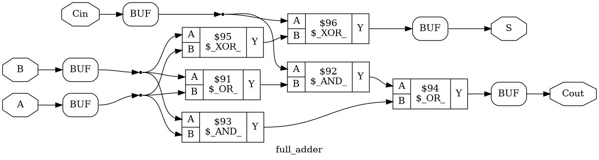
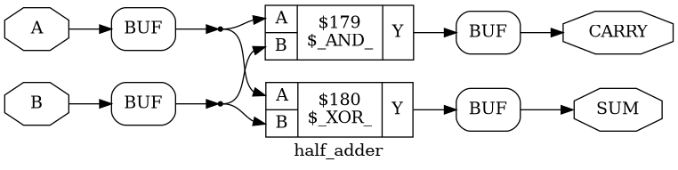

# Day 4/365 — First Yosys Synthesis (Half/Full Adder)

Today I pushed the half- and full-adder designs through Yosys to see what the gate-level netlists look like. First time using the tool, so I kept notes on what clicked and what still feels fuzzy.

## What I learned
- Synthesis turns RTL (Verilog/SystemVerilog) into gate-level netlists sized for ASIC/FPGA fabrics.
- Different RTLs with the same behavior can map to very different hardware costs; synthesis exposes that.
- Yosys flow I used: `read_verilog` → `hierarchy -top` → `proc` → `opt` → `techmap` → `abc -g AND,OR,XOR` → `write_verilog`.
- Quick stats after `abc`:
  - Full adder: 6 cells (2 AND, 2 OR, 2 XOR) — matches the typical implementation.
  - Half adder: 2 cells (1 AND, 1 XOR).

## Artifacts
- Gate-level Verilog netlists: [fulladder_synth.v](fulladder_synth.v), [halfadder_synth.v](halfadder_synth.v)
- Gate-level schematics exported from `show`:
  - Full adder: 
  - Half adder: 

## Commands I ran
```yosys
read_verilog fulladder.v
hierarchy -check -top full_adder
proc
opt
techmap
abc -g AND,OR,XOR
write_verilog fulladder_synth.v

read_verilog halfadder.v
hierarchy -check -top half_adder
proc
opt
techmap
abc -g AND,OR,XOR
write_verilog halfadder_synth.v
```

## Takeaways / next steps
- Start reading the generated netlists to connect the dots between RTL and gates.
- Try adding area/power estimates with a richer library, and compare with alternative RTLs.
- Automate this flow with a short Yosys script so I can re-run faster on future designs.

## Reference
- Video I followed: [Yosys intro](https://youtu.be/aQ-G5yFrfUk?si=IgCmUiXLUgj9CDzg)


