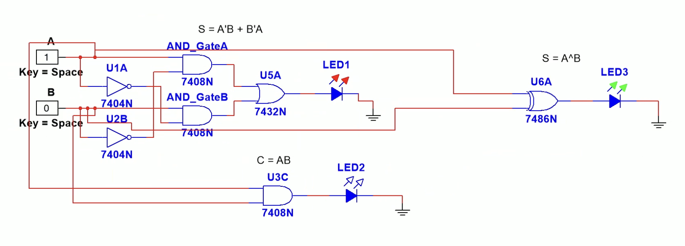
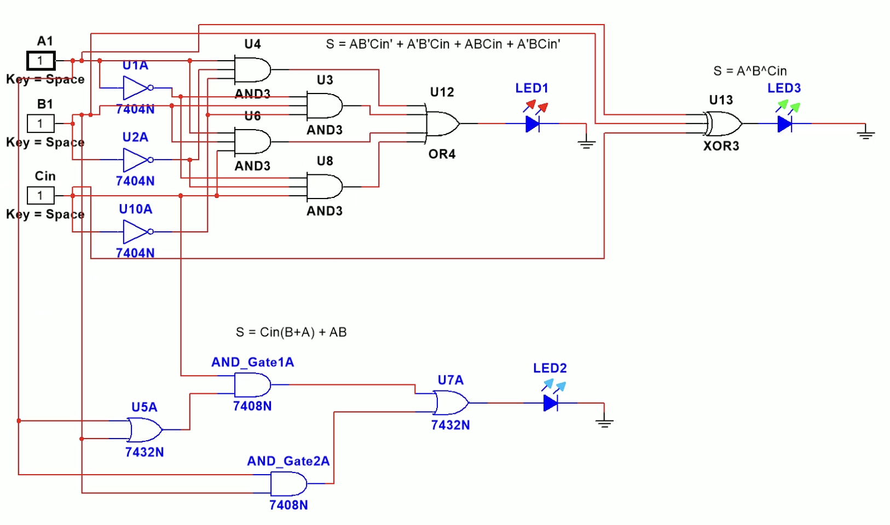

# Adders

Some basic digital circuits I'm building out. Started with the theory, then moved to Multisim to actually simulate them and see how they work. Built the Verilog implementations and found some bugs when simulating in Vivado - fixed those on day 3. Also implemented them in C to verify the logic and revisited structs (something I had forgotten but that's exactly why I'm doing this repo - pushing myself everyday to get good at this).

## Half Adder

This one takes two bits and adds them together. Pretty straightforward - just XOR for the sum and AND for the carry.

**What it does:**
- Sum = A XOR B
- Carry = A AND B

**Testing it out:**

When A=1 and B=0, we get Sum=1 and Carry=0 (makes sense, 1+0=1 with no overflow):


When A=1 and B=1, we get Sum=0 and Carry=1 (1+1=10 in binary):


## Full Adder

This one's a bit more complex - it takes two input bits AND a carry-in bit. So you can chain them together for multi-bit addition.

**What it does:**
- Sum = A XOR B XOR Cin
- Carry Out = (Cin AND (B OR A)) OR (A AND B)

**Testing it:**

With A=0, B=1, Cin=1, we get Sum=0 and Cout=1 (0+1+1=10 in binary):


With A=1, B=1, Cin=1, we get Sum=1 and Cout=1 (1+1+1=11 in binary):


## Files

- `halfadder.v` - Half adder module
- `fulladder.v` - Full adder module  
- `testbench.v` - Tests for both of them
- `halfadder.c` - Half adder implementation in C (using structs)
- `fulladder.c` - Full adder implementation in C (using structs)

## To Run

### Verilog Simulation
Just simulate it with your Verilog tool:
```bash
verilog halfadder.v fulladder.v testbench.v
```

### C Implementation
Compile and run the C versions:
```bash
gcc halfadder.c -o halfadder && ./halfadder
gcc fulladder.c -o fulladder && ./fulladder
```

## Progress Log

### Day 4/365 - January 4, 2026
- First Yosys synthesis run for the half- and full-adder; captured gate-level netlists and schematics.
- Artifacts: [4_365.md](4_365.md), [fulladder_synth.v](fulladder_synth.v), [halfadder_synth.v](halfadder_synth.v), [image.yosys_show.png](image.yosys_show.png) (full adder), [halfadder.yosys_show.png](halfadder.yosys_show.png) (half adder).
- Flow: `read_verilog` → `hierarchy -top` → `proc` → `opt` → `techmap` → `abc -g AND,OR,XOR` → `write_verilog`.

### Day 3/365 - January 3, 2026
Made some mistakes in the initial Verilog code that I caught when running the simulation in Vivado today. Fixed the bugs in `fulladder.v`, `halfadder.v`, and `testbench.v`. The simulation now works correctly!

Also implemented both adders in C using structs (good practice since I had forgotten about them). Compiled and ran them on Ubuntu to verify the results matched - they did!

**Vivado Simulation Results:**


**C Implementation Results:**

Full Adder output:


Half Adder output:


### Day 2/365
Initial Verilog implementations and testbench. Simulated in Multisim to understand the logic.

---

**Day 3/365** - Committed to getting better at this one day at a time.
